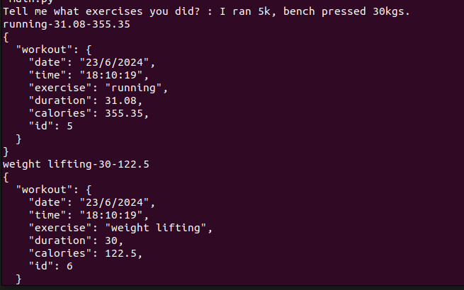
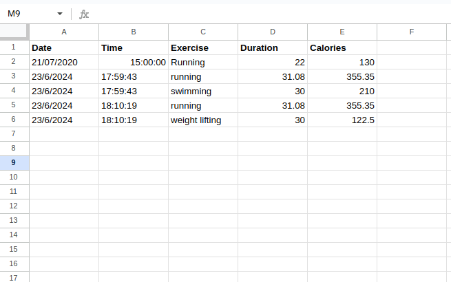

# Exercise-nlp-recorder
A program which takes textual input describing the exercises done, extracts data from it using Nutritionix's NLP algorithm, and saves the data
onto a google sheet.

## Screenshots
1. Conversion of text to appropriate data.

2. Logging the data into google sheets.

