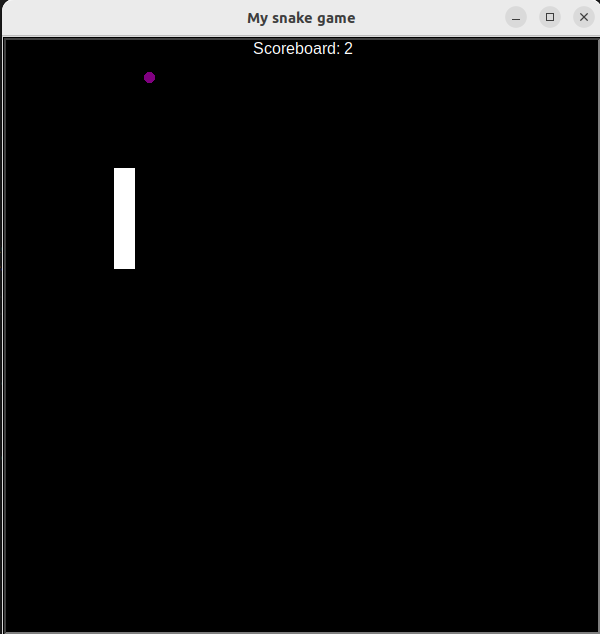
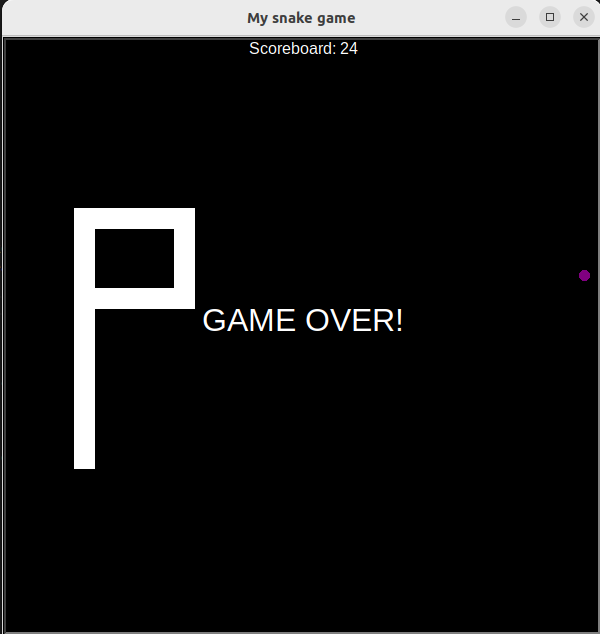

# Classic Snake Game

This project is a classic snake game implemented in Python. It's a nostalgic journey back to the era of old-school arcade games. The game features a snake that moves around the screen, eating food to grow longer. The objective is to avoid collisions with the walls and the snake's own body while trying to achieve the highest score possible.

## Features
- Simple and intuitive controls.
- Increasing difficulty as the snake grows longer.
- Score tracking to challenge yourself or compete with friends.
- Game over screen displaying the final score.

## Requirements
- Python 3.x

## How to Play
1. Install Python 3.x if not already installed.
2. Clone this repository to your local machine.
3. Run `python3 main.py` from the command line.
4. Use the arrow keys to control the direction of the snake.
5. Eat as much food as possible without colliding with the walls or the snake itself.
6. Enjoy the classic gaming experience!

## Screenshots

